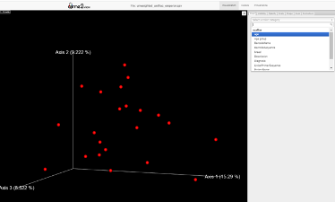
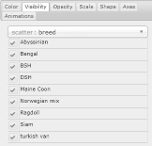

# How to Use the Interactive Emperor Plot

1. **Rotate and Zoom**  
    - Click and drag on the plot to rotate the view.  
    - Use your mouse wheel or trackpad to zoom in or out.  
   

2. **Color Tab**  
    - Select a metadata category from the dropdown to color your points based on that category.  
    - This helps distinguish different groups visually.  

        

3. **Visibility Tab**  
    - Check or uncheck categories to show or hide specific groups of points.  
    - This makes it easy to focus on particular subsets of your data.
    - *Disclaimer:* This feature is for visualization purposes only and may not fully represent the underlying data patterns due to how PCoA is calculated.    

        

4. **Axes Tab**  
    - Choose which principal components (PCs) are displayed on each axis.  
    - Exploring different PCs can reveal new patterns in your data.  

5. **Shape Tab**  
    - Change the shape of data points based on a metadata category.  
    - This provides an additional way to distinguish groups.  

6. **Animations Tab**  
    - Enable or disable animations to automatically rotate the plot or smoothly transition between views.  
    - This can help present your data in a more dynamic way.  

These controls let you customize how your data is displayed and make it easier to spot patterns or compare groups. 
