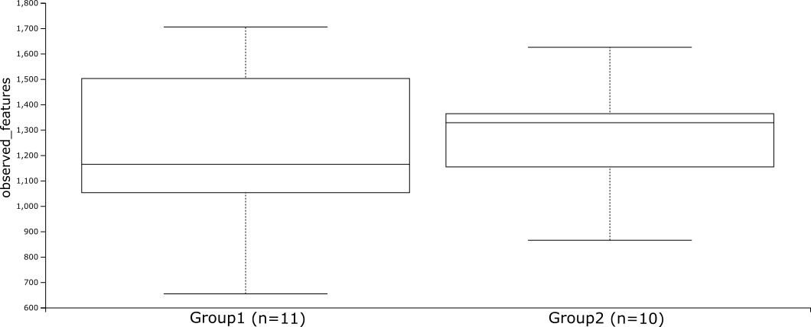
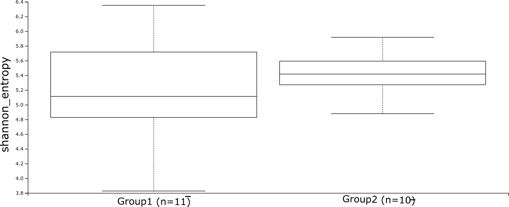

# Alpha Diversity

*Another metric to measure microbiome diversity is alpha diversity, which measures the diversity within samples. For example, alpha diversity can describe the species diversity within a single community or sample. It provides information about how diverse or rich the microbial community is within each sample.*

---

## Observed Features

### Observed Features Statistics

| Group 1 | Group 2 | H | p-value | q-value |
|---------|---------|---|---------|---------|
| Group1 (n=11) | Group2 (n=10) | 0.005 | 0.944 | 0.944 |

!!! note

    Observed features statistics performed with pairwise Kruskal-Wallis test.

---

## Shannon Index

### Shannon Statistics

| Group 1 | Group 2 | H | p-value | q-value |
|---------|---------|---|---------|---------|
| Group1 (n=11) | Group2 (n=10) | 0.714 | 0.398 | 0.398 |

!!! note

    Shannon index statistics performed with pairwise Kruskal-Wallis test.
