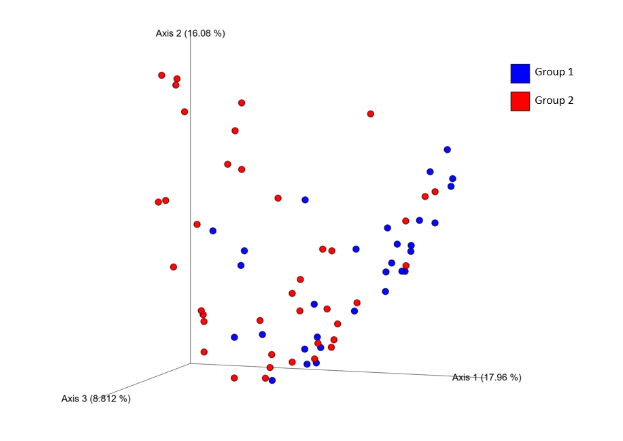

# Beta Diversity

*Beta diversity is a metric used to measure the microbiome diversity between different samples or groups.  It provides information about how similar or different the microbial communities are between the different groups.*

---

## Bray-Curtis PCoA

| Group 1 | Group 2 | Sample size | Permutations | pseudo-F | p-value | q-value |
|---------|---------|-------------|--------------|----------|---------|---------|
| group1 | group2 | 50 | 999 | 3.916 | 0.001 | 0.002 |

!!! note

    Omnibus Bray-Curtis PCoA statistics performed using permutational analysis of variance with 999 permutations (PERMANOVA).

