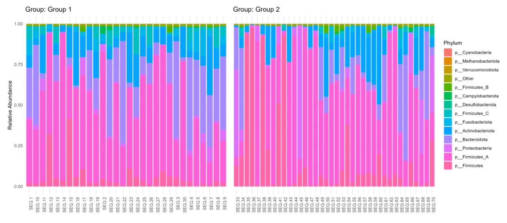

# Taxa Summary

The shotgun metagenomic sequencing showed small changes in fecal bacterial taxa at phylum, family, genus, and species levels between the two groups.

The overall changes in the relative abundance at the phylum level between the groups are graphically shown in the stacked barplot below.

## Stacked Barplot (Phylum)

## Differential Abundance Analysis

Differentially abundant taxa between the groups at phylum, family, genus, species, and strain levels were identified using Analysis of Composition of Microbiomes with Bias Correction (ANCOMBC) from the R package ANCOMBC (v 2.2.0) using the default parameters.

ANCOMBC Results can be found below:

[Download](https://www.dropbox.com/scl/fi/wdrqf5cy10leyydkaxy5x/ANCOMBC_Group1vsGroup2.xlsx?rlkey=rc0dss8z32u6c18u41pm6ujc2&st=ho1e7m9f&dl=0)
